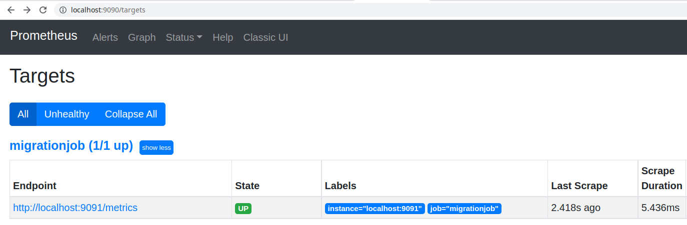
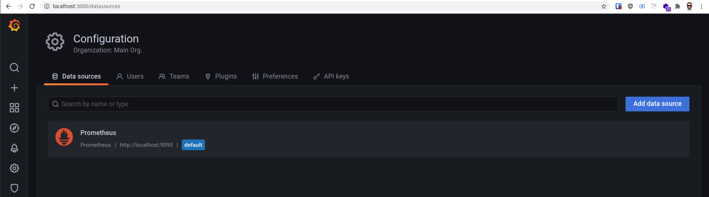
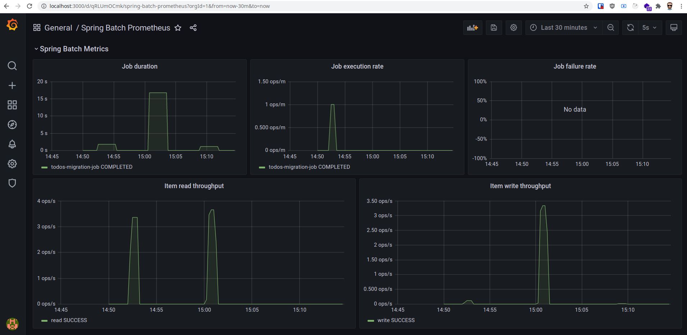

# Spring Batch POC

> Ce projet permet de découvrir le potentiel de Spring Batch

## Les Jobs

Liste des Jobs de l'application

- Todo Job (todos-migration-job)

## Dashboard

Un dashboard est développé en Angular.

Il permet de:

- Lancer un Job en passant des paramètres
- Afficher l'historique des Jobs executés

## Setup développement

Lancer le serveur `./mvnw spring-boot:run`

Lancer le serveur de dev de Angular `cd src/main/migration-dashboard && ng serve`

Dashboard <http://localhost:8001>

Liste des jobs <http://localhost:8001/api/migration/jobs/job-list>

Liste des instances de jobs <http://localhost:8001/api/migration/jobs/job-instances>

Liste des executions de jobs <http://localhost:8001/api/migration/jobs/job-executions>

Todo Job <http://localhost:8001/api/migration/run/todo-job>

## Metrics (Prometheus + Grafana)

### Installer Prometheus

```bash
wget https://github.com/prometheus/prometheus/releases/download/v2.29.1/prometheus-2.29.1.linux-amd64.tar.gz
```

### Lancer Prometheus

```bash
./prometheus --config.file=./documentation/metrics/resources/prometheus.yml
```

### Lancer Prometheus gateway

```bash
docker run -d -p 9091:9091 prom/pushgateway
```



### Installer Grafana et le lancer

```bash
docker run -d --name=grafana -p 3000:3000 --add-host="localhost:YOUR_IP_ADDRESS" grafana/grafana
```

### Configurer l'application pour les metrics

Dans `application.properties`

```env
# ===============================
# = Metrics
# ===============================

prometheus.push.rate=5000
prometheus.job.name=migrationjob
prometheus.grouping.key=migration
prometheus.pushgateway.url=0.0.0.0:9091
```

### Configurer la datasource Prometheus



### Uploader le dashboard

[spring-batch-dashboard](./documentation/metrics/resources/spring-batch-dashboard.json)


